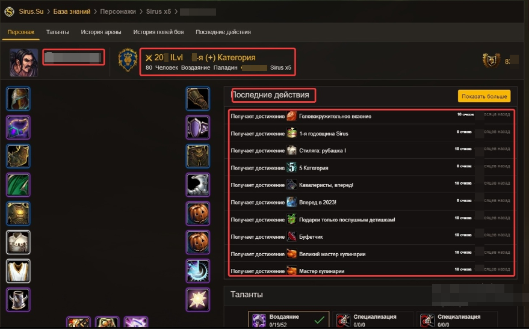
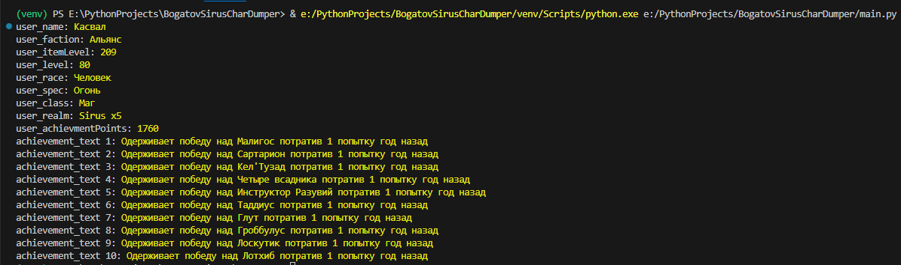

# BogatovSirusCharDumper

## Описание

Получаем в консоли информацию о персонаже с сайта по ссылке.

На текущий момент умеем определять:
- [x] Имя
- [x] Фракцию
- [x] Уровень персонажа
- [x] Уровень экипировки
- [x] Расса
- [x] Спек
- [x] Класс
- [x] Реалм
- [x] Очков достижений
- [x] Последние действия (10 шт)
- [ ] ...

---

## Настройка

- Изменить путь к `main.py` в `*.bat` файле на свой
- Установить и активировать виртуальное окружение
- Установить все библиотеки из `requirements.txt`
> Гайд, как это сделать - лежит в `requirements.txt` в комментарии 

---

## Использование offline версии

- Найти ссылку на персонажа
> Например: https://sirus.su/base/character/57/9202/
- Скачать код страницы в формате `*.html`
- Поместить по адресу `.\BogatovSirusCharDumper\_Target\`
- Дать файлу имя `index.html`
- Запустить `run.bat`
- Дождаться результата

Результат

---

## Использование online версии (Не готово!!!)

- Запустить `run.bat`
- Ввести ссылку на персонажа и нажать `Enter`
> Например: https://sirus.su/base/character/57/9202/
- Дождаться результата

---

# Ссылки
| Описание | Ссылка |
| ------ | ------ |
Репо: | [github.com/gitalexhubuser/BogatovSirusCharDumper](https://github.com/gitalexhubuser/BogatovSirusCharDumper)
